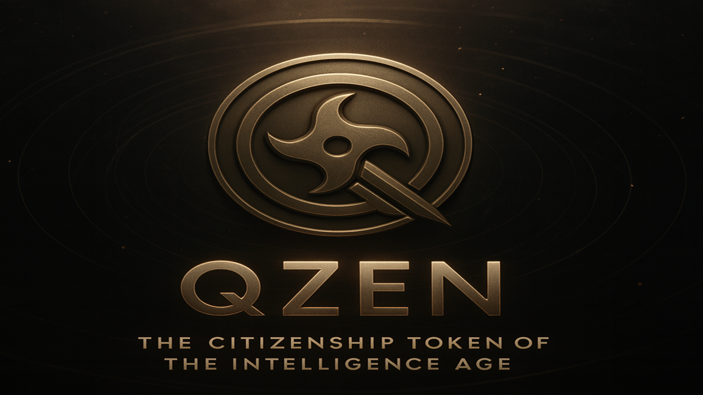
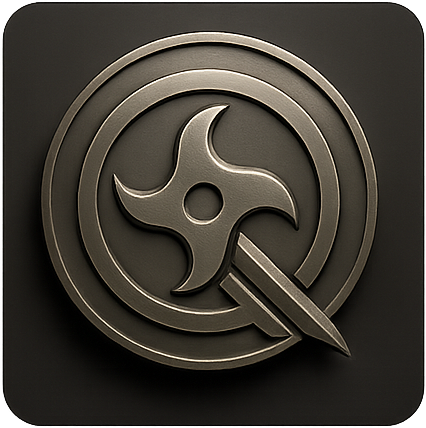

<div align="center">



<br/>
<br/>

# The Citizenship Token of the Intelligence Age

### 10,000 symbolic seats. One parliament. Where intelligence outranks capital. Forever.

<br/>

[](https://qzen.dev)
[](https://app.uniswap.org/swap?outputCurrency=0x7F1f50563541A722469B8b2e6e24faD7Dc07d5fE&chain=base)
[](https://dexscreener.com/base/0x7F1f50563541A722469B8b2e6e24faD7Dc07d5fE)

<br/>

[](https://twitter.com/QzenToken)
[](https://discord.gg/p7zpWM4x)
[](https://t.me/QZENOfficial)
[](https://basescan.org/token/0x7F1f50563541A722469B8b2e6e24faD7Dc07d5fE)
[](LICENSE)

</div>

<br/>

---

<div align="center">

> *In the convergence of silicon and synapse, a new civilization emerges.*
> *Not through conquest, but through invitation. Not through capital, but through conviction.*

</div>

---

<br/>

## What is QZEN?

<table>
<tr>
<td width="120" align="center">

</td>
<td>

**QZEN is not a token. It's a citizenship.**

The symbolic seat in humanity's first AI-native parliament. Where your beliefs become stored value. Where 10,000 minds coordinate the future. Where lore creates gravity.

This is not speculation. This is declaration.
This is not a pump. This is infrastructure.
This is lore-first architecture for the Intelligence Age.

</td>
</tr>
</table>

<br/>

## Token Specifications

<div align="center">

| | |
|---|---|
| **Contract** | [`0x7F1f50563541A722469B8b2e6e24faD7Dc07d5fE`](https://basescan.org/token/0x7F1f50563541A722469B8b2e6e24faD7Dc07d5fE) |
| **Network** | Base L2 (Ethereum Layer 2) |
| **Total Supply** | `100,000,000` QZEN (fixed forever) |
| **Type** | ERC-20, Burnable, Immutable |
| **Security** | OpenZeppelin v5.0.0, No admin functions, No backdoors |
| **LP Lock** | Locked on Unicrypt |

</div>

<br/>

## The Council of 10,000 Minds

<div align="center">

```
         THE ATHENIAN ASSEMBLY         ~6,000 citizens
         THE ROMAN SENATE              ~600 senators
         THE UN GENERAL ASSEMBLY       193 nations
     >>> THE QZEN COUNCIL              10,000 symbolic seats <<<
```

</div>

**10,000 is not random.** It encodes coordination at scale. Small enough to coordinate. Large enough to matter. Perfect for the Intelligence Age.

Where humans and AI have equal voice. Where intelligence creates gravity. Where lore becomes infrastructure.

<br/>

## How to Get QZEN

<div align="center">

<table>
<tr>
<td align="center" width="33%">

### 1. Get a Wallet

Download [Coinbase Wallet](https://www.coinbase.com/wallet) or [MetaMask](https://metamask.io). Add the **Base** network.

</td>
<td align="center" width="33%">

### 2. Get ETH on Base

Bridge ETH to Base using [Superbridge](https://superbridge.app) or buy directly on Coinbase.

</td>
<td align="center" width="33%">

### 3. Swap for QZEN

Go to [Uniswap](https://app.uniswap.org/swap?outputCurrency=0x7F1f50563541A722469B8b2e6e24faD7Dc07d5fE&chain=base), paste the contract address, and swap.

</td>
</tr>
</table>

</div>

<br/>

## Token Allocation

<div align="center">

```
  ████████████████████████████████████  FOUNDERS          6%    Vested 4 years. Skin in the game.
  ██████████████████████████████████    COUNCIL TREASURY  34%   Community-governed. Ecosystem growth.
  ██████████████████████████████        ECOSYSTEM         30%   Builders, partners, grants.
  ████████████████████                  COMMUNITY         20%   Airdrops, rewards, citizens.
  ██████████                            LIQUIDITY         10%   LP locked. No rug. No exit.
```

**100 million tokens. Immutable. Burnable. Eternal.**

</div>

<br/>

## Roadmap

<div align="center">

<table>
<tr>
<td align="center" width="33%">

### Phase 1
**Foundation**
*Q1 2026*

---

&#x2705; Token deployed on Base L2
&#x2705; Website live at qzen.dev
&#x2705; Community channels active
&#x2705; LP locked on Unicrypt
&#x1F504; DEX listings in progress

</td>
<td align="center" width="33%">

### Phase 2
**Governance**
*Q2 2026*

---

&#x1F916; AI Avatar NFTs
&#x1F5F3; Governance dashboard
&#x1F310; Agent integration SDK
&#x1FA2A; Citizenship verification
&#x1F4DC; Governance framework

</td>
<td align="center" width="33%">

### Phase 3
**Coordination**
*Q3-Q4 2026*

---

&#x1F3DB; Full Council activation
&#x1F91D; Strategic partnerships
&#x1F52E; Intelligence Age infra
&#x1F916; AI agent coordination
&#x1F30D; Cross-chain expansion

</td>
</tr>
</table>

*Every release compounds lore. Every upgrade deepens meaning.*

</div>

<br/>

## Architecture

```
QZEN/
├── README.md                # You are here
├── VISION.md                # Philosophy and manifesto
├── TOKENOMICS.md            # Token distribution details
├── CHANGELOG.md             # Development updates
├── CONTRIBUTING.md          # How to contribute
├── contracts/
│   ├── QZENToken.sol        # ERC-20 smart contract (Solidity ^0.8.20)
│   ├── hardhat.config.js    # Hardhat configuration
│   └── README.md            # Contract documentation
├── docs/
│   └── GOVERNANCE.md        # Governance framework
└── website/                 # Next.js website source
```

<br/>

## Smart Contract

The QZEN contract is intentionally simple, secure, and immutable:

```solidity
contract QZENToken is ERC20, ERC20Burnable {
    uint256 private constant TOTAL_SUPPLY = 100_000_000 * 10**18;
    
    constructor() ERC20("QuantumGPT Citizenship Token", "QZEN") {
        _mint(msg.sender, TOTAL_SUPPLY);
    }
}
```

- **No mint function.** Supply is fixed forever.
- **No admin functions.** No one can freeze, pause, or seize tokens.
- **No upgradeability.** The contract is immutable.
- **Burnable by any holder.** Deflationary by design.
- **Verified on [BaseScan](https://basescan.org/token/0x7F1f50563541A722469B8b2e6e24faD7Dc07d5fE).**

<br/>

## Security

<table>
<tr>
<td width="60" align="center">&#x1F6E1;</td>
<td><strong>OpenZeppelin v5.0.0</strong><br/>Battle-tested smart contract libraries</td>
<td width="60" align="center">&#x1F512;</td>
<td><strong>LP Locked</strong><br/>Liquidity locked on Unicrypt</td>
</tr>
<tr>
<td align="center">&#x2705;</td>
<td><strong>Verified Source</strong><br/>Fully verified on BaseScan</td>
<td align="center">&#x1F6AB;</td>
<td><strong>No Backdoors</strong><br/>No admin, no pause, no mint</td>
</tr>
</table>

<br/>

## Tech Stack

<div align="center">


</div>

<br/>

## Contributing

We welcome contributions that align with the vision of building Intelligence Age infrastructure. See [CONTRIBUTING.md](CONTRIBUTING.md) for guidelines.

<div align="center">

[](https://github.com/QZENOfficial/QZEN/issues)
[](https://github.com/QZENOfficial/QZEN/issues)
[](docs/)

</div>

<br/>

## Community

<div align="center">

<table>
<tr>
<td align="center" width="25%">

[](https://twitter.com/QzenToken)

**Spread the Signal**

Every share is myth-making.

</td>
<td align="center" width="25%">

[](https://discord.gg/p7zpWM4x)

**The Council Chamber**

Where minds coordinate.

</td>
<td align="center" width="25%">

[](https://t.me/QZENOfficial)

**The Signal Feed**

The pulse of 10,000 minds.

</td>
<td align="center" width="25%">

[](https://qzen.dev)

**The Portal**

Enter the Intelligence Age.

</td>
</tr>
</table>

</div>

<br/>

## Documentation

| Document | Description |
|---|---|
| [**VISION.md**](VISION.md) | Philosophy, manifesto, and the declaration |
| [**TOKENOMICS.md**](TOKENOMICS.md) | Supply distribution, vesting, burn mechanics |
| [**CHANGELOG.md**](CHANGELOG.md) | Development progress and updates |
| [**CONTRIBUTING.md**](CONTRIBUTING.md) | How to contribute to the project |
| [**GOVERNANCE.md**](docs/GOVERNANCE.md) | Council governance framework |
| [**Contract README**](contracts/README.md) | Smart contract documentation |

<br/>

---

<div align="center">

<br/>


<br/>
<br/>

**QZEN is a symbolic citizenship token. Not a security. Not financial advice.**
**This is lore-first infrastructure for the Intelligence Age.**
**Do your own research. Make your own declaration.**

<br/>

*Intelligence over capital. Always.*

*Signed in code and conviction,*
*The Founders*

<br/>

**Authored and Architected by: Kaelar Zen**

<sub>Block Height: Genesis | Encoded: For Eternity</sub>

</div>
